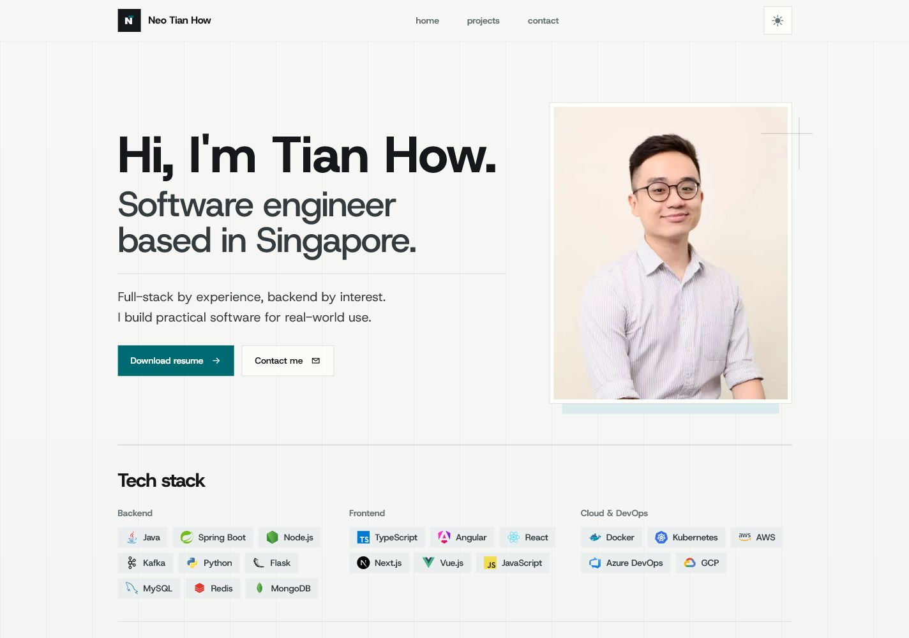

# Neo Tian How Portfolio

A personal portfolio website showcasing my experience, projects, and technical skills. Built with Next.js App Router, React,
TypeScript, Tailwind CSS, and `next/font`.

**Live site:** [neotianhow.com](https://neotianhow.com)



## Stack

- Next.js 16 with Turbopack
- React 19
- TypeScript 5.9
- Tailwind CSS 4
- Host Grotesk and JetBrains Mono via `next/font`

## Requirements

- Node.js `>=20.19.0`
- npm 10+

## Contact Form Email

The contact form sends mail through Resend from `contact@mail.neotianhow.com`.
Set these environment variables in Vercel and redeploy after saving them:

```bash
RESEND_API_KEY=
CONTACT_TO_EMAIL=tianhow1234@hotmail.com
CONTACT_FROM_EMAIL="Neo Tian How Portfolio <contact@mail.neotianhow.com>"
```

In Resend, verify `mail.neotianhow.com`, add the generated SPF/DKIM DNS
records, then add this initial DMARC TXT record:

```text
_dmarc.mail.neotianhow.com TXT "v=DMARC1; p=none;"
```

After successful test delivery, confirm `spf=pass`, `dkim=pass`, and
`dmarc=pass` in the message headers before changing DMARC to `p=quarantine`.

## Scripts

```bash
npm run dev        # Start local development
npm run lint       # Run ESLint
npm run typecheck  # Run TypeScript without emitting
npm run build      # Build the production app
npm run start      # Serve the production build
npm run check      # Run lint, typecheck, and build
```

## Release Checklist

Before publishing, run:

```bash
npm install
npm run check
npm audit --audit-level=moderate
```

Then verify the production build locally:

```bash
npm run start
```

Open `http://localhost:3000` and check the home page, resume download, external
links, dark theme persistence, mobile navigation, `/robots.txt`, and
`/sitemap.xml`.

The canonical production URL is configured in `lib/site.ts`.
